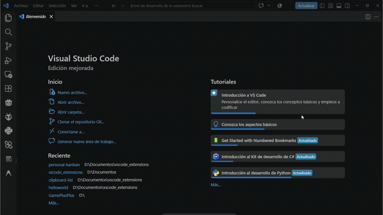

# Personal Kanban Editor for VS Code 📋


<p align="center">
  
</p>

Transform any `.kanban.md` file into an interactive, visual, and fully customizable Kanban board directly inside Visual Studio Code. All your data stays in standard Markdown format, making it completely compatible with version control systems like Git.

---

## ✨ Key Features

- **Markdown-Based Storage (`.kanban.md`)**: Your data is saved in clean, readable plain text using YAML Frontmatter and standard Markdown task lists[cite: 1].
- **Full CRUD Operations**:
  - **Columns**: Add, rename, recolor, and delete columns effortlessly[cite: 1, 2].
  - **Cards**: Create, edit titles, assign due dates, recolor, and delete cards quickly[cite: 1, 2].
  - **Tags**: Global tag management system with custom names and colors[cite: 1, 2].
- **Color Customization**: Customize background colors for the board, column headers, individual cards, and tag badges[cite: 1, 2].
- **Due Dates**: Assign due dates to cards to easily track deadlines[cite: 1, 2].
- **Modern & Responsive UI**: Smooth and clean layout inspired by professional Kanban boards (like Trello/Jira)[cite: 2].

---

## 🚀 Quick Start

1. Create or open any file with the `.kanban.md` extension in your workspace[cite: 1, 2].
2. VS Code will automatically launch the interactive Kanban board view[cite: 1, 2].
3. Start organizing your tasks! Every action performed on the board updates and saves your Markdown file in real time[cite: 1, 2].

> **Tip:** If you want to view or edit the raw Markdown text, right-click the file tab and select **Open With... > Text Editor**.

---

## 📝 Example `.kanban.md` File Structure

Your data is stored while maintaining a clean internal Markdown structure:

```markdown
---
kanban-plugin: board
boardColor: "#0f172a"
tags:
  - id: "tag-1"
    name: "Bug"
    color: "#ef4444"
  - id: "tag-2"
    name: "Feature"
    color: "#3b82f6"
---

## In Progress %% color: #3b82f6 %%
- [ ] Implement tag management system %% id: card-1, color: "#3b82f6", tags: ["tag-2"], dueDate: "2026-10-15" %%
- [ ] Fix styling issues %% id: card-2, color: "#ef4444", tags: ["tag-1"], dueDate: "2026-10-01" %%

## Completed
- [ ] Initial extension setup %% id: card-3, tags: [] %%